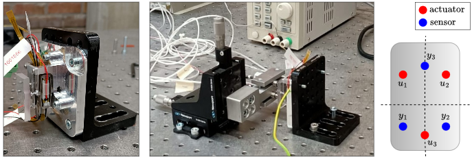

# CubeSpec Fine Steering Mirror benchmark dataset

> Part of [nonlinearbenchmarks.org](https://www.nonlinearbenchmark.org/) and its [official dataloader](https://github.com/MaartenSchoukens/nonlinear_benchmarks).

<p align="center">
  
</p>

This benchmark dataset contains input–output data from the CubeSpec Fine Steering Mirror, a multi-input multi-output high-precision control platform used in a small satellite. Voltages applied to three piezo-actuators serve as inputs, while the mirror displacements measured at three non-collocated reference points serve as outputs.

The excitation signals are orthogonal random-phase multisines spanning a wide frequency range, and are applied at three different amplitude levels.  The system behaves mostly linearly, but the presence of hysteresis in the piezo-actuators introduces dynamic nonlinearities, making the dataset well-suited for benchmarking nonlinear identification methods. Key challenges mainly arise from its high dimensionality and include, e.g., model order selection, the decoupling of multivariate nonlinearities, and maintaining computational tractability during both identification and deployment.

Further details about the dataset and its experimental setup can be found [here](https://past.isma-isaac.be/downloads/isma2024/proceedings/Contribution_245_proceeding_3.pdf).

## Baseline models

Baseline models are provided for benchmarking purposes. Three linear 28th-order state-space models are
fitted separately at each amplitude level. In addition, a single nonlinear
LFR model with a feedforward neural network in the feedback path is fitted
using data from all three amplitude levels combined. All models are
estimated using the
[`freq-statespace`](https://github.com/merijnfloren/freq-statespace)
package. The fitting and analysis results can be found in the
`baseline_results/` folder.

## Citation

If you use this dataset, please cite:

```bibtex
@article{floren2024data,
  title={Data-driven state-space identification and nonlinearity assessment of the CubeSpec Fine Steering Mirror},
  author={Floren, Merijn and Peri, Leonardo and De Maeyer, Jeroen and De Munter, Wim and Vandepitte, Dirk and No{\"e}l, Jean-Philippe},
  journal={ISMA-USD2024},
  pages={2042--2052},
  year={2024}
}
```

When referring to the baseline models, please cite:
```
@misc{floren2026baseline,
  author       = {Merijn Floren},
  title        = {Baseline models for the {Fine Steering Mirror} benchmark dataset},
  month        = apr,
  year         = {2026},
  publisher    = {Zenodo},
  note         = {Version v2026.04.15},
  doi          = {10.5281/zenodo.19591136},
  url          = {https://doi.org/10.5281/zenodo.19591136},
  howpublished = {\url{https://doi.org/10.5281/zenodo.19591136}},
}
```
